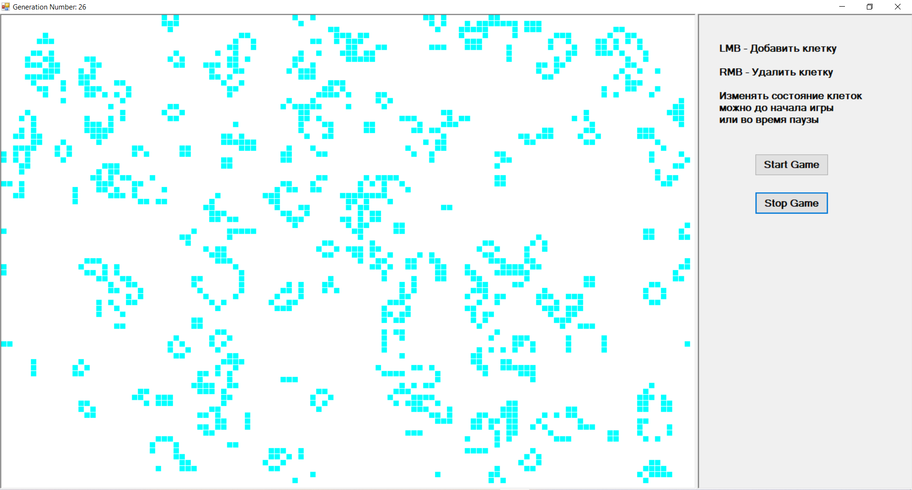

# LifeTheGame
------------
Famous Conway's game of life.    
Created with C# Windows Forms .Net Framework 4.7.2 
------------

- Для запуска игры в папке Build найти файл [Debug.rar](https://github.com/Police-Cat/LifeTheGame/blob/master/Build/Debug.rar) разархивуруйте и найдите .exe файл, запустите его.  

- Для открытия проекта в IDE необходимо открыть файл LifeTheGame.sln  

- Основная логика находится в файлах:  

  - [Пользовательский интерфейс: MainForm.cs](https://github.com/Police-Cat/LifeTheGame/blob/master/LifeTheGame/MainForm.cs)

  - [Игровая логика: GameEngine.cs](https://github.com/Police-Cat/LifeTheGame/blob/master/LifeTheGame/GameEngine.cs)

